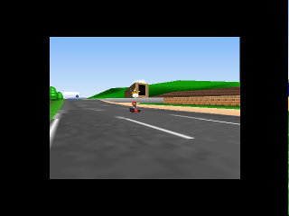

# MarioKart64 Environment

This page describes the MarioKart64 environment(s).

## Configuration

A configuration file ([`mario_kart_config.yml`](mario_kart_config.yml)) has been provided for this game. Currently the only configuration setting is `ROM_PATH`. This setting must specify the full path to the MarioKart64 ROM on your system. As mentioned on the top page, links to ROM files will not be provided here.

## Implementation Details

### `MarioKartEnv`:

#### Methods:

* Implementation of base abstract methods:
    * `_navigate_menu()` moves through the game menu from startup to the beginning of an episode.

        This method sends `NOOP` to the controller server except in the following frames:
        
        *      10: Nintendo screen - Press 'A'
        *      80: Mario Kart splash screen - Press 'A'
        *     120: Select number of players - Press 'A'
        *     125: Select GrandPrix or TimeTrials - Joystick Down
        *     130: Select TimeTrials - Press 'A'
        *     132: Select Begin - Press 'A'
        *     134: OK - Press 'A'
        * 150-156: Move to the correct player
        *     160: Select player - Press 'A'
        *     162: OK - Press 'A'
        * 195-202: Move to the correct map series
        *     202: Select map series - Press 'A'
        * 223-230: Move to the correct map choice
        *     230: Select map choice - Press 'A'
        *     232: OK - Press 'A'
        
        
        At frame 284, the level is fully loaded and ready to go.

    * `_get_reward()` determines the reward for each step.
        * Typically each step rewards `-1`.
        * At the change of each lap, rewards `10`.
        * At the end of the race, rewards `215`. (*This is to account for delay in detecting the end of the race*).

    * `_evaluate_end_state()` determines whether or not the episode is over.
    
        At the end of each race, the game shrinks the view to   multiple smaller frames in order to show lap/race times.  We sample the corners of the screen, and if all four corners are pure black pixels for 30 frames in a row, we consider it the end of the race (episode).

        
        

    * `_reset()` resets the environment to begin a new episode.

        If the environment is at the end of an episode, `reset()` will navigate the post-race menu to retry the course (see `_navigate_post_race_menu()` below). Other scenarios still need to be implemented (e.g. mid-race should pause and then retry).

* Additional class methods:
    * `_navigate_post_race_menu()` called by `reset()`

        This method sends `NOOP` to the controller server except in the following frames:
        * 60: Result times screen - Press 'A'
        * 75: Post-race menu (retry selected) - Press 'A'

        At frame 138, the level is fully loaded and ready to go.

    * `_set_character(character)` returns the row and column of the specified character.
        * `mario`
        * `luigi`
        * `peach`
        * `toad`
        * `yoshi`
        * `d.k.`
        * `wario`
        * `bowser`

    * `_get_lap()` returns the current lap number. This method evaluates the color of the pixel at `(203, 50)`. This point is constant throughout the race and is indicative of the current lap. The color map is stored in `LAP_COLOR_MAP`.

### `track_envs.py`:

This file contains definitions for subclasses of `MarioKartEnv` which provide environments for each of the 16 available tracks/courses. These classes simply set the value of the `MAP_SERIES` and `MAP_CHOICE` constants.

