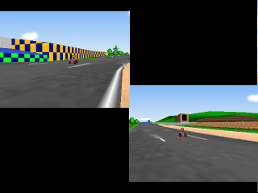

# MarioKart64 Environment

This page describes the MarioKart64 environment(s).

## Configuration

A configuration file ([`mario_kart_config.yml`](mario_kart_config.yml)) has been provided for this game. Currently the only configuration setting is `ROM_PATH`. This setting must specify the full path to the MarioKart64 ROM on your system. As mentioned on the top page, links to ROM files will not be provided here.

## Implementation Details

### `MarioKartEnv`:

#### Methods:

* Implementation of base abstract methods:
    * `_navigate_menu()` moves through the game menu from startup to the beginning of an episode.

        This method sends `NOOP` to the controller server except in the following frames:
        
        * 10: Nintendo screen - Press 'A'
        * 80: Mario Kart splash screen - Press 'A'
        * 120: Select number of players - Press 'A'
        * 125: Select GrandPrix or TimeTrials - Joystick Down
        * 130: Select TimeTrials - Press 'A'
        * 132: Select Begin - Press 'A'
        * 134: OK - Press 'A'
        * 150-156: Move to the correct player
        * 160: Select player - Press 'A'
        * 162: OK - Press 'A'
        * 195-202: Move to the correct map series
        * 202: Select map series - Press 'A'
        * 223-230: Move to the correct map choice
        * 230: Select map choice - Press 'A'
        * 232: OK - Press 'A'
        
        
        At frame 284, the level is fully loaded and ready to go.

    * `_get_reward()` determines the reward for each step.
        * Typically each step rewards `-1`
        * At the change of each lap, rewards `100`
        * At the end of the race, rewards `1000` plus `215` (*to account for delay of 215 steps in detecting the end of the race*)

        *Checkpoint rewards*:
        
        There are also environment options to allow checkpoint rewards. The checkpoint reward system monitors the character progress on the mini-map. It samples designated points on the mini-map (which should be near-white pixels). When the character reaches a checkpoint, the mini indicator covers the sampled pixel with red/black, which is detected and results in a reward of `100`.

        * The checkpoints are tracked per lap and can only be achieved once per lap

          > This prevents an agent from learning to do doughnuts over a checkpoint. 

        * The checkpoints must be earned sequentially
        
        * The checkpoints may not be skipped
        
          >Some areas of the course allow the character to drive far enough off road to bypass the checkpoint on the mini-map. In this case, the character will not achieve checkpoint rewards, even if it gets back on track.

          > These two rules simplify things and eliminate the need to determine if the character is driving backwards and collecting the checkpoints in reverse.

    * `_evaluate_end_state()` determines whether or not the episode is over.
    
        At the end of each race, the game shrinks the view to multiple smaller frames in order to show lap/race times. We sample the corners of the screen, and if the pixels in all four corners are the same color for 30 frames in a row, we consider it the end of the race (episode).

        
        

    * `_reset()` resets the environment to begin a new episode.

        If the environment is at the end of an episode, `reset()` will navigate the post-race menu to retry the course (see `_navigate_post_race_menu()` below). If the environment is not at the end of an episode (i.e. still mid-race), it will pause the game and navigate the menu to retry the course. Other scenarios still need to be implemented (e.g. future support for random characters/courses would need to navigate through different menu options).

* Additional class methods:
    * `_navigate_post_race_menu()` called by `reset()`

        This method sends `NOOP` to the controller server except in the following frames:
        * 60: Result times screen - Press 'A'
        * 75: Post-race menu (retry selected) - Press 'A'

        At frame 138, the level is fully loaded and ready to go.

    * `_set_character(character)` returns the row and column of the specified character.
        * `mario`
        * `luigi`
        * `peach`
        * `toad`
        * `yoshi`
        * `d.k.`
        * `wario`
        * `bowser`

    * `_get_lap()` returns the current lap number. This method evaluates the color of the pixel at `(203, 50)`. This point is constant throughout the race and is indicative of the current lap. The color map is stored in `LAP_COLOR_MAP`.

### `track_envs.py`:

This file contains definitions for subclasses of `MarioKartEnv` which provide environments for each of the 16 available tracks/courses. These classes simply set the value of the `MAP_SERIES` and `MAP_CHOICE` constants.

### Action Space:
The default environments use the existing base class provided action space (see the [initialization section](..\\..\\..\\README.md#Initialization) for details). However, there are also discrete versions of these environments as well (as of 2017.11.10, only Luigi Raceway has been added). This is well-suited for AI agents that are designed to produce a [1-hot](https://machinelearningmastery.com/how-to-one-hot-encode-sequence-data-in-python/) type output. It allows the agent to pick the 'appropriate' action from a set rather than directly outputting the controller state. The discrete action space provides the following 12 options:
* NO_OP
* Straight
* Brake
* Back-up
* Soft left
* Left
* Hard left
* Extreme left
* Soft right
* Right
* Hard right
* Extreme right

For the definitions of these actions, see `discrete_envs.py`

